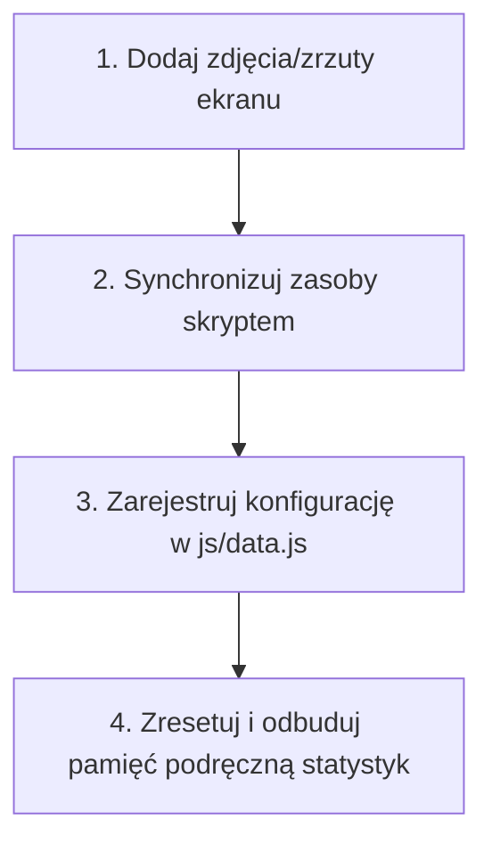

# 🚀 Instrukcja dodawania nowej karty aplikacji do WD HUB

Niniejszy dokument opisuje kroki niezbędne do poprawnego zarejestrowania i wdrożenia nowej karty aplikacji w głównym panelu **WD HUB**.

---

## ⚡ Metoda 1: Automatyczna (Zalecana)

Przygotowaliśmy skrypt automatyzujący cały proces (pobieranie informacji z GitHub API, automatyczne uruchomienie przeglądarki headless w celu wykonania zrzutu ekranu z zalogowanym kontem gościa, aktualizacja `js/data.js` oraz odświeżenie pamięci podręcznej statystyk).

### Uruchomienie skryptu:

Wystarczy otworzyć terminal w głównym katalogu `WD_HUB` i uruchomić:

```bash
python scripts/add_app.py https://github.com/WowkDigital/NazwaRepozytorium
```

### Opcjonalne flagi:
- `--url`: Niestandardowy adres wdrożenia (domyślnie skrypt użyje pola `homepage` z GitHuba lub wygeneruje adres GitHub Pages `https://wowkdigital.github.io/NazwaRepozytorium/`).
- `--icon`: Nazwa ikony z biblioteki Lucide (np. `layers`, `activity`, `globe`, domyślnie: `globe`).
- `--color`: Klasa koloru Tailwind (np. `indigo-500`, `emerald-500`, domyślnie: `primary`).
- `--effect`: Efekt najechania hover (np. `hueRotate`, `glitch`, `matrix`, `shake`, `neon`, domyślnie: `hueRotate`).
- `--title`: Niestandardowy tytuł wyświetlany na karcie (domyślnie pobierany z nazwy repozytorium).
- `--desc`: Niestandardowy krótki opis (do 1-2 zdań).
- `--long-desc`: Niestandardowy pełny opis projektu.

**Przykład z opcjami:**
```bash
python scripts/add_app.py https://github.com/WowkDigital/MemoCard --icon layers --color indigo-500 --effect hueRotate
```

Po zakończeniu działania skryptu zrestartuj serwer lub odśwież stronę w przeglądarce, aby załadować nowe dane.

---

## 🛠️ Metoda 2: Ręczna (Krok po kroku)

## 📋 Schemat działania w 5 krokach



---

### Krok 1: Przygotowanie zrzutu ekranu (Preview Image)
Zadbaj o wysokiej jakości podgląd aplikacji.
1. Stwórz nowy katalog dla zasobów graficznych aplikacji w katalogu `assets/`:
   ```bash
   assets/<NazwaAplikacji>/
   ```
2. Umieść tam grafikę podglądu (np. `preview.png`). Wspierane formaty to: `.png`, `.jpg`, `.jpeg`, `.gif`, `.svg`, `.webp`.

> [!TIP]
> Grafika powinna mieć proporcje zbliżone do 16:9, ciemny motyw i minimalistyczny, premium wygląd pasujący do reszty ekosystemu.

---

### Krok 2: Synchronizacja zasobów (`assetsManifest`)
WD HUB wykorzystuje automatyczny rejestr zasobów w pliku `js/data.js`, aby aplikacja mogła odczytywać zrzuty ekranu bez backendu.
1. Otwórz terminal w katalogu projektu `WD_HUB`.
2. Uruchom skrypt synchronizacyjny:
   ```bash
   node scripts/sync-assets.js
   # lub: npm run sync-assets
   ```
Skrypt automatycznie przeskanuje folder `assets/` i zaktualizuje obiekt `assetsManifest` na początku pliku `js/data.js`.

---

### Krok 3: Rejestracja projektu w `js/data.js`
Otwórz plik `js/data.js` i dodaj nowy obiekt do tablicy `projects`.

#### Przykład struktury obiektu:
```javascript
{
    title: "NAZWA-APLIKACJI",
    description: "Krótki, przyciągający uwagę opis wyświetlany bezpośrednio na karcie (maksymalnie 1-2 zdania).",
    longDescription: "Szczegółowy opis projektu, jego głównych funkcji i technologii, który wyświetli się w oknie dialogowym (modal) po kliknięciu karty.",
    url: "https://wowkdigital.github.io/NazwaRepozytorium/",
    github: "https://github.com/WowkDigital/NazwaRepozytorium",
    icon: "activity", // Identyfikator ikony z biblioteki Lucide Icons
    color: "emerald-500", // Klasa koloru Tailwind (np. emerald-500, blue-500, violet-400)
    effect: "hueRotate", // Efekt hover: 'hueRotate', 'glitch', 'matrix', 'shake' lub brak
    imageFolder: "assets/NazwaAplikacji" // Ścieżka zadeklarowana w assetsManifest
}
```

> [!IMPORTANT]
> - Upewnij się, że ikona (`icon`) jest dostępna w bibliotece **Lucide Icons** (np. `activity`, `waves`, `train`, `pen-tool`).
> - Upewnij się, że parametr `imageFolder` dokładnie odpowiada kluczowi wygenerowanemu w `assetsManifest`.

---

### Krok 4: Odbudowa pamięci podręcznej statystyk (GitHub Stats Cache)
HUB pobiera daty utworzenia oraz ostatniej aktualizacji projektów bezpośrednio z GitHub API i zapisuje je lokalnie, by nie przekroczyć limitów zapytań (Rate Limiting). Aby nowo dodana aplikacja natychmiast otrzymała poprawne statystyki:
1. Usuń plik pamięci podręcznej z głównego katalogu:
   ```bash
   # Powershell
   Remove-Item -Path "github-stats-cache.json" -ErrorAction SilentlyContinue
   ```
2. Zrestartuj serwer node:
   ```bash
   node server.js
   ```
Serwer wykryje brak pamięci podręcznej i na starcie automatycznie wyśle zapytania do API GitHub dla wszystkich projektów (w tym nowego), a następnie utworzy świeży plik `github-stats-cache.json`.

---

### Krok 5: Weryfikacja wizualna
1. Uruchom serwer i przejdź pod adres `http://localhost:3000/`.
2. Sprawdź następujące elementy:
   - Czy karta wyświetla się poprawnie w widoku **Featured** (Siatka wyróżnionych) oraz **A-Z Gallery** (Galeria alfabetyczna).
   - Czy kliknięcie w kartę otwiera okno szczegółów z poprawnie wczytanym zrzutem ekranu i pełnym opisem.
   - Czy przyciski **Launch** oraz **GitHub** prowadzą do właściwych adresów URL.
   - Czy daty utworzenia i aktualizacji nie wyświetlają statusu `Loading...` / `N/A`.
